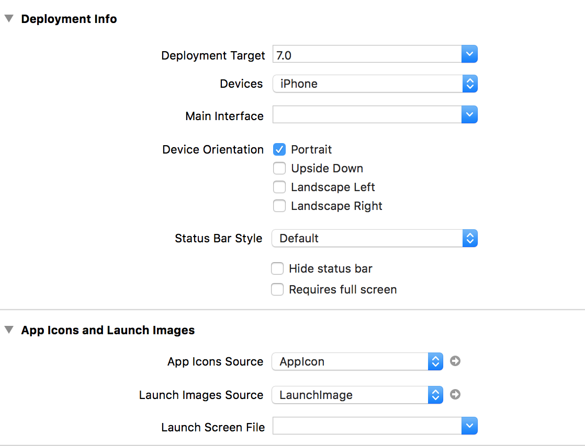
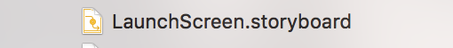
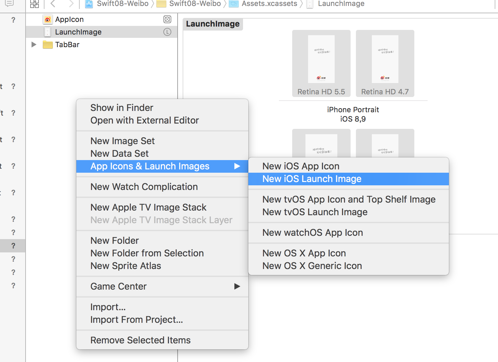
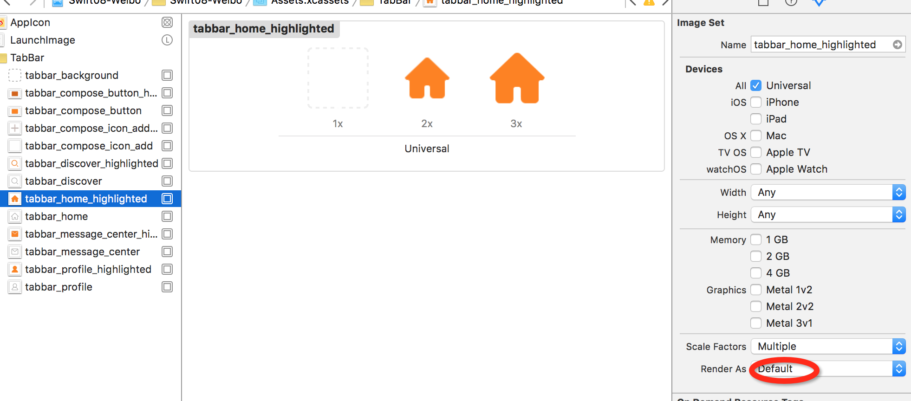

====
##Swift08-项目搭建
>sina微博项目搭建

1. 配置文件
<pre>
iOS7 以上适配 
禁止横屏
只适配iphone

删除了

添加了

</pre>

2.快速创建文件
<pre>
commond + j (定位到目录结构) ->
commond + c (复制名称) ->
commond + n ()创建文件
</pre>

3.知识点
<pre>
//1.
 /// 运行之后发现 tintcolor 为蓝色 应改为橙色
        //设置tabbar颜色
        //注意 在iOS7之前  设置tintColor只会改变字体颜色  不会改变图片颜色 
        //需要修改  render as Original Image
        tabBar.tintColor = UIColor.orangeColor()
        
        
  //2.      
  //        home.tabBarItem.title = "首页"
//        home.navigationItem.title = "首页"
        //上面 两句 等价于下面 一句
        // 从内像外设置, nav和tabbar都有
        home.title = "首页"
</pre>